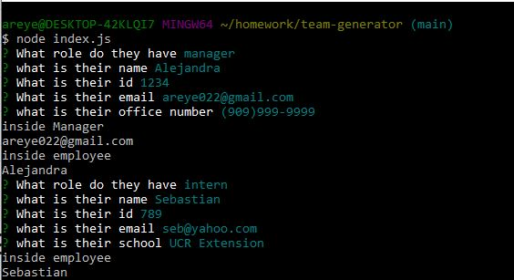
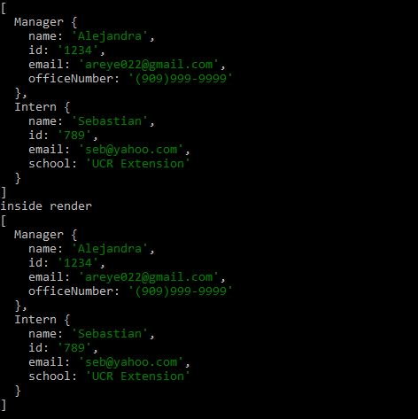

# Team Generator

### Deployed Application 

[Video of Team Generator](https://drive.google.com/file/d/1yfzPRsE-vCWXTj0nZ1PuhxUAZOzFecfN/view)

### Description 
This command line application allows users to generate an HTML page with employee information based on the position the employee has.

Before creating the file, npm inquirer must be installed. Then, the user will enter 'node index.js' into the command line. This command will then prompt a series of questions that are based on the position that was chosen for the employee. The options are manager, engineer, or intern. The user can continue adding employees until they select 'done' on the first prompted question (this is demonstrated in the attached video).After all the appropriate prompts have been answered, the input will be used to generate an HTML file with each employees information organized in a card. 

### Features
* Uses CLI Node.js 
* JavaScript   
* Utilizes Inquirer to capture user inputs 
* Uses fs to read files
* Runs tests using Jest

### Credit
Alejandra Reyes
* areye022@gmail.com
* [GitHub](https://github.com/areye022)
* [LinkedIn](https://www.linkedin.com/in/alejandrareyes022/)

### License
Licensed under [MIT License](./LICENSE)
